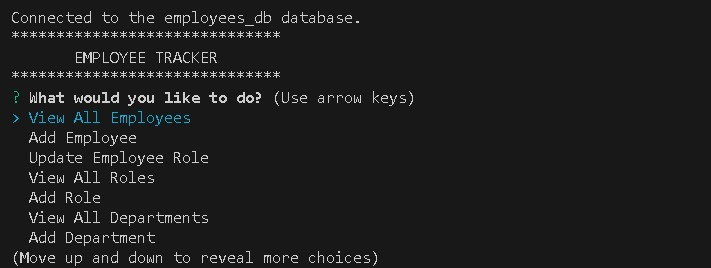
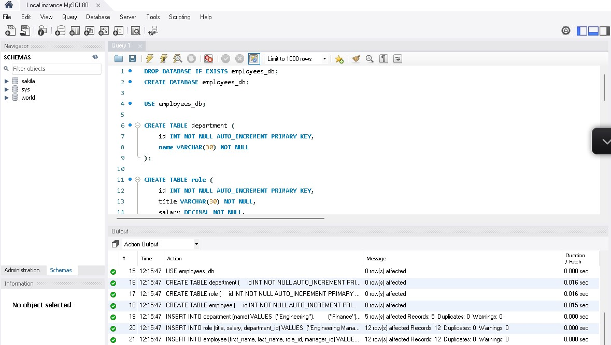

# sql-hw

# Description:
This is an employee tracker database. It allows users to input departments, roles, and employees, update an employee's role, and view a table of departments, roles, and employees.

# Installation:
Created through Github
installed inquirer 
installed mysql2 
googled more information on, and installed console.table package 
To connect to the database, once files are downloaded to you computer, you will need to change the password on line 11 of the server.js file to your own password
Usage:
Open terminal and navigate to employee_tracker folder
Type npm init -y into terminal to create a new .json file
Type npm i into terminal
Type npm i inquirer into terminal
Type npm i mysql2 into terminal
Type npm i console.table into terminal

(note: if all else fails be sure to add schema and seeds to sql workbench, this was a problem i was trying to figure out forever. Image example below)

Travel to sql-hw and open terminal then type "node app.js"
Follow prompts to enter and select the option you would like

# Link to Video of Walkthrough for Demonstration:

https://drive.google.com/file/d/1SVOnCvprsFryS3ejfxt4ENfoTofJsI9w/view

# Other Links 

Github Repository URL: https://github.com/Trouterwen/sql-hw

Github Read.me link: https://github.com/Trouterwen/sql-hw/blob/main/README.md

# Screenshots:

